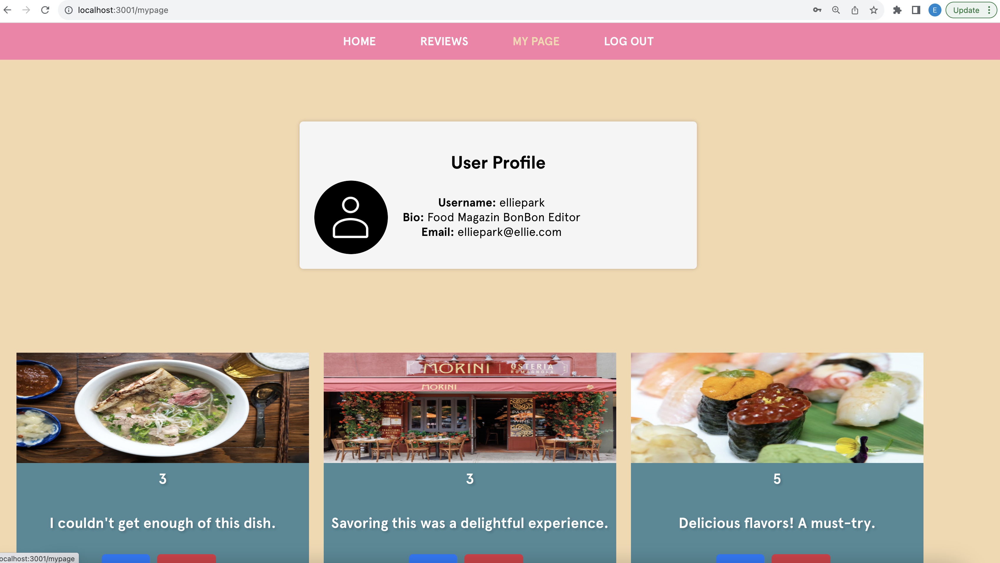
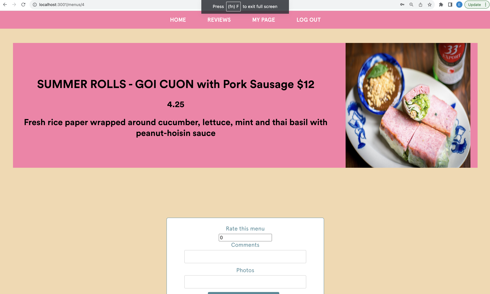
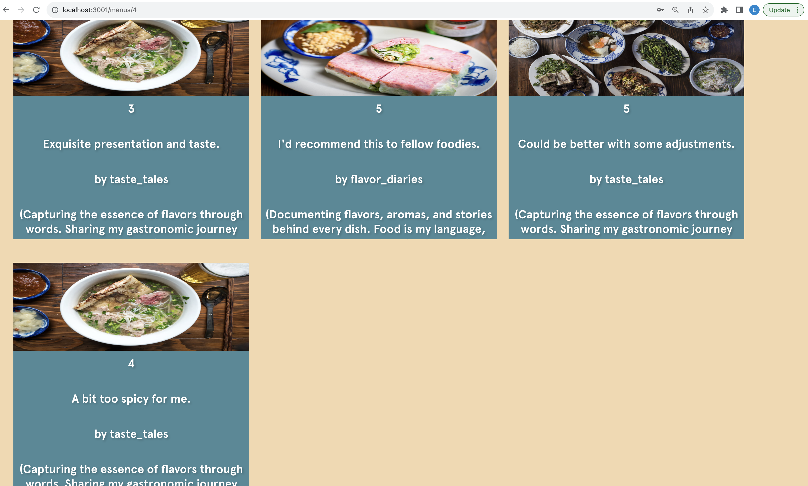
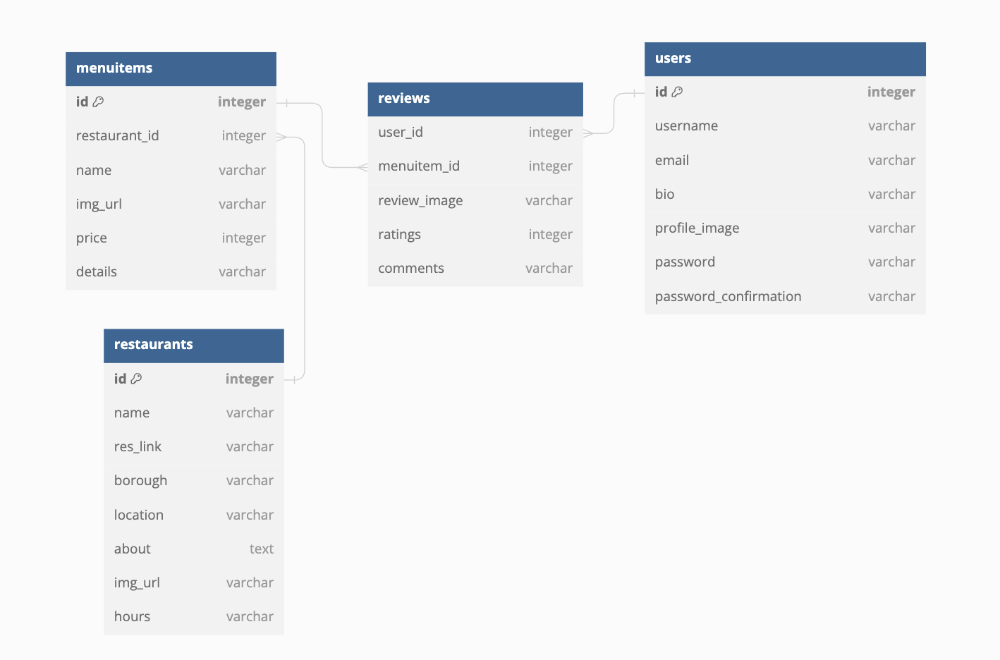

# Project Name
CREME DE LE CREME
## Description

CREME DE LA CREME is for finding the right menu for your restaurant experience with reviews for menus not  for restaurant, so that you get more speicific ideas what to choose.  
## Getting Started

### Prerequisites
- Rails 
1. bundle install '
2. rails db:drop 
3. rails db:create
4. rails db:migrate db:seed 
5. rails server (s)

- React 
1. npm install
2. npm start
### Built With

- React

- Ruby on Rails

- CSS

- Rendering with Heroku 

## Usage
- mypage after login or signup with the user profile with image using active storage, and list of reviews of current user (edit, delete review)

- menu detail page with the average ratings and add a new review. 

- Table Diagram 
